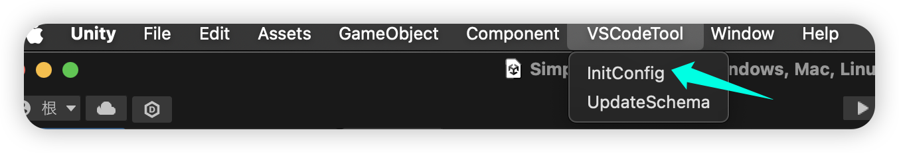
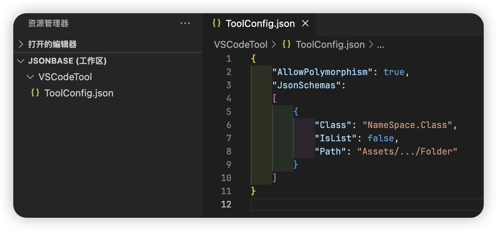
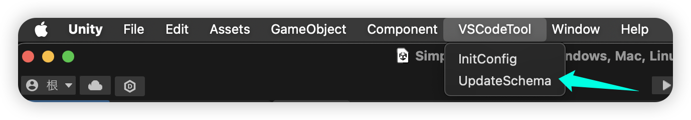
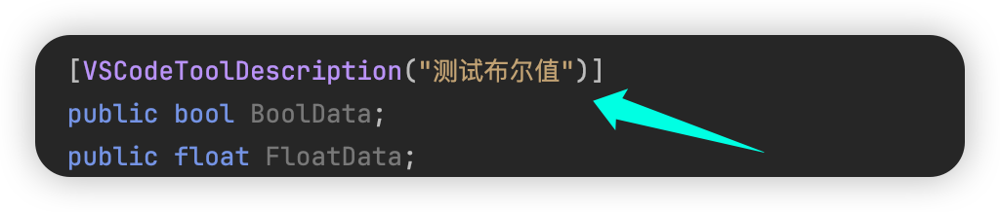

# VSCodeTool
## 1. 这个工具用来做什么？
对于一个游戏项目来说，文本编辑器是非常重要的管线模块，它具有**格式自由、编辑方便、不卡顿、与引擎解耦**等优点，但文本编辑器却有一个致命缺陷：**原生不提供数据的预设格式和参数类型校验功能**，这使得文本编辑器在没有定制插件补足功能的情况下学习成本和编辑效率都达不到可用范围。  
而VSCodeTool 就是基于 **VSCode** 和 **JsonSchema** 而设计的一个**通用 Json 文本编辑辅助工具**，原理是通过反射采集数据类的信息，然后以 JsonSchema 的格式进行编写并索引到 VSCode_WorkSpace 中，从而利用 VSCode自带的 JsonSchema 功能变相实现 Json 文本补全和格式校验。  VSCodeTool 的优缺点如下：

优点：**轻量、通用、不依赖插件**

缺点：**使用条件限制为 VSCode + Json、必须打开 WorkSpace**
## 2. 怎么安装和使用？
将文件夹拖入项目中，等待编译完成即可

完成安装后点击 VSCodeTool/InitConfig 生成工具的 Config 以及 WorkSpace 文件，WorkSpace 文件在工程的根目录中，在 VSCode 中打开 WorkSpace 后修改工具 Config

AllowPolymorphism指是否针对列表或字典数据中的多态存储提供文本补全支持

JsonSchemeas 中可配置 Json 的数据类以及 Json 文件路径的映射关系，IsList 表示一个该路径下的 Json 文件中容纳一组数据还是单个数据。

配置完成后点击 VSCodeTool/UpdateSchema，工具会自动生成 JsonSchema 文件并索引到 WorkSpace 中，在对应路径下创建 Json 文件就可以使用文本补全和格式校验了。

另外 VSCodeTool 还提供了快速注释功能，在数据类对应的变量上使用 VSCodeToolDescription 进行标注后重新生成 JsonSchema 文件，此时再进行 Json 文本编辑时对应的字段就会显示注释了。
## 3. 一些注意事项
建议 Unity 版本：**Unity2017.4+**  

目前支持的 C# 变量类型：**float、int、bool、string、enum、struct、class、Array、List、Dictionary(键必须是 string)**，不支持泛型类。   
 
列表和字典的多态存储补全支持需要配合 **FullSerializer 插件**的多态存储功能才能正常使用，启用前请先安装好该插件